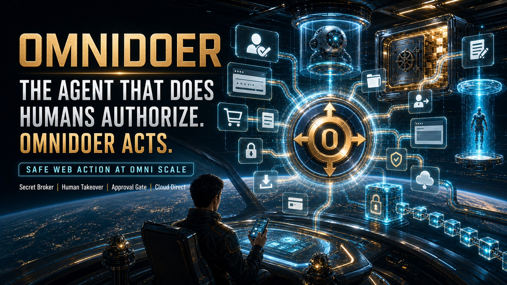
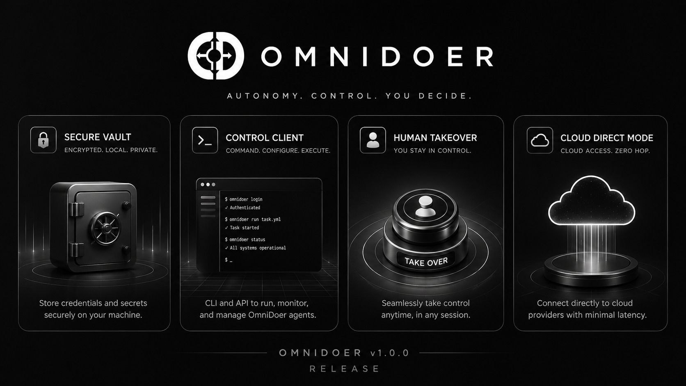
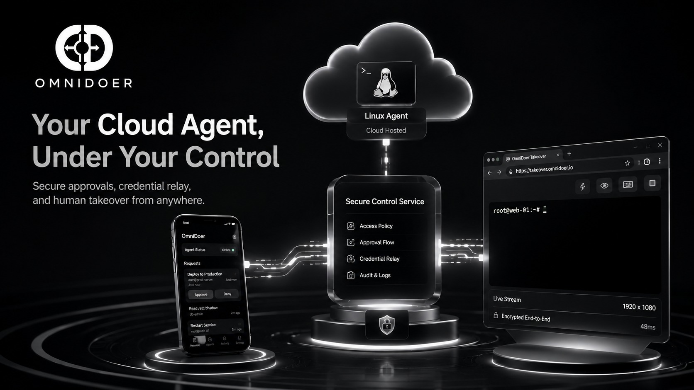
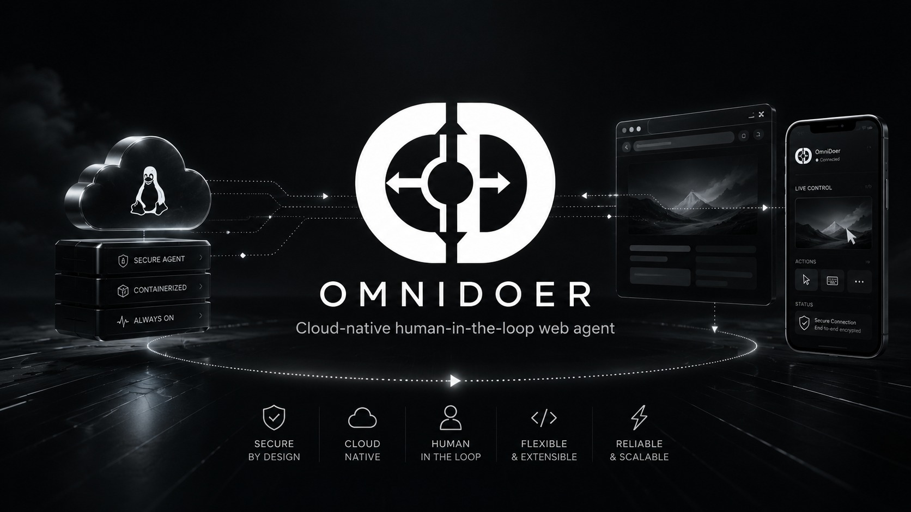

# OmniDoer 发布：Agent 时代的执行权协议

> 原文发布：<https://mp.weixin.qq.com/s/g3WAQnAMi1PfCM0Tev71tQ>  
> 官网：<https://omnidoer.github.io>  
> 开源仓库：<https://github.com/omnidoer/omnidoer>

今天，我们发布 **OmniDoer**。

这不是一个浏览器自动化脚本。  
不是一个密码管理器。  
不是一个远程桌面。  
不是一个新的聊天机器人。  
也不是另一个“全自动 Agent Demo”。

**OmniDoer 是 Agent 进入真实世界之前，必须拥有的一层执行权协议。**

过去，模型负责回答。  
后来，模型开始写代码。  
再后来，Codex CLI 让模型进入终端，读取仓库、修改文件、运行命令、修复测试。

但这还不是真实世界的终点。

因为真实世界不只有代码。  
真实世界还有账号、密码、支付、MFA、风控、验证码、审批、密钥、审计、设备确认、权限边界和人的最终判断。

当 Agent 开始触碰这些东西时，一个更根本的问题出现了：

> **智能体可以思考，但它凭什么行动？**

OmniDoer 要回答的，就是这个问题。



> OmniDoer：模型决策，用户授权；云端执行，人工接管；密码不进入模型上下文。

---

## 01 Agent 时代真正稀缺的，不是智力，而是行动许可

过去我们以为，Agent 的瓶颈是模型不够聪明。

于是我们等待更大的上下文。  
等待更强的推理。  
等待更好的工具调用。  
等待更便宜的算力。  
等待本地模型成熟。

但当我们真正把 Agent 放进业务现场时，会发现问题并不止于“它会不会做”。

真正的问题是：

- 它有没有权做？
- 谁给它这个权？
- 这个权什么时候失效？
- 它能不能碰密码？
- 它能不能点支付？
- 它能不能通过 MFA？
- 它遇到风控时怎么办？
- 它执行失败后谁负责？
- 它的每一步能不能被审计？

这时你会意识到：

> **Agent 的下一次跃迁，不是从 GPT-4 到 GPT-5，也不是从云端到本地。**  
> **而是从“能思考”到“被授权地行动”。**

OmniDoer 发布的不是一个工具。

它发布的是一条边界：

> **模型可以决策，但执行权必须被授权。**



---

## 02 Codex 给了 Agent 大脑，OmniDoer 给它可控的身体

Codex CLI 是一个重要分水岭。

它让模型第一次真正进入工程现场：

- 它能看代码；
- 它能改文件；
- 它能运行命令；
- 它能调用工具；
- 它能在终端里连续工作；
- 它能把自然语言转化成真实工程动作。

这相当于给模型装上了工程大脑。

但大脑不是身体。

当 Codex 只是在仓库里修测试时，这已经足够震撼。

但当 Agent 要进入真实业务系统时，它会遇到另一类完全不同的问题：

- 登录真实账号；
- 输入密码；
- 操作后台；
- 读取账单；
- 处理订单；
- 触发支付；
- 通过 MFA；
- 面对 CAPTCHA；
- 进入风控页面；
- 接触生产数据；
- 执行高权限动作。

这些不再是“代码任务”。

这些是现实世界的 **身份动作**。

在这里，模型不应该天然拥有一切。

它不应该拥有你的密码。  
不应该拥有你的支付最终确认权。  
不应该拥有你的 MFA 答案。  
不应该拥有你的 Passkey 私钥。  
不应该绕过风控。  
不应该在高风险动作上替你做最后决定。

所以 OmniDoer 不是为了让 Codex “更会想”。

OmniDoer 是为了让 Codex **安全地做**。

Codex 是大脑。  
OmniDoer 是身体。  
Control Client 是神经系统。  
Secret Broker 是免疫系统。  
Human Takeover 是人的刹车。  
Audit Log 是记忆。

这是 Agent 从“聪明程序”变成“可控行动体”的第一步。

---

## 03 过去的 Agent Demo 为什么无法进入真实业务？

因为它们在一个关键地方失败了：

它们把“能不能执行”和“应不应该执行”混在了一起。

一个 Agent 可以打开网页。  
可以点击按钮。  
可以填表单。  
可以提交请求。  
可以完成一段流程。

但真实业务不是这样运行的。

真实业务有：

- 权限边界；
- 账号边界；
- 金额边界；
- 审批边界；
- 身份边界；
- 法律边界；
- 审计边界；
- 人的最终判断。

如果 Agent 在这些边界前继续自动化，它就不再是助手。

它会变成一个拥有过多权力的黑盒执行器。

这就是为什么很多 Agent 项目看起来很强，却只能停留在演示阶段。

它们能完成“网页任务”。  
但不能安全进入“账号、支付、风控、强认证”的真实世界。

OmniDoer 的判断是：

> Agent 不是缺一个更聪明的大脑。  
> Agent 缺的是执行权的操作系统。

这个操作系统的第一个公开版本，现在开源在：

<https://github.com/omnidoer/omnidoer>

---

## 04 OmniDoer 的第一原则：模型永远不应该拥有你的身份

OmniDoer 的第一原则非常简单：

> 模型可以使用工具，但不能拥有身份。

身份是什么？

身份不是一个用户名。  
身份不是一个密码。  
身份也不只是一个 Cookie。

身份包括：

- 密码；
- TOTP seed；
- 一次性验证码；
- Session；
- Cookie；
- OAuth 授权；
- 设备指纹；
- MFA 状态；
- Passkey；
- 支付确认；
- 风险上下文；
- 最终授权按钮。

这些东西组合在一起，才是“你”。

如果一个 Agent 拥有这些，它就不只是帮你工作。

它在某种意义上变成了你。

OmniDoer 不接受这个设计。

在 OmniDoer 里：

- 密码不进入模型上下文；
- MFA 答案不进入工具返回值；
- 支付确认不由模型直接完成；
- CAPTCHA 不交给模型识别；
- 高强度 anti-bot 不尝试绕过；
- 用户接管期间的输入不写入日志；
- Codex 只看到状态，不看到秘密。

这不是靠 prompt 约束。

这是一条系统边界。

---

## 05 Secret Broker：密码第一次有了“安全中继层”

在传统 Agent 里，登录通常有两种糟糕选择。

第一种，把密码告诉 Agent。  
这很危险。

第二种，让 Agent 卡住，等待用户手动处理。  
这很低效。

OmniDoer 提供第三种方式：

> Agent 请求凭据，但永远不读取凭据。

流程是这样的：

```text
Agent 需要登录
↓
创建凭据请求
↓
Control Client 弹出安全输入框
↓
用户输入密码
↓
客户端本地加密
↓
密文发送到用户自己的云服务器
↓
Secret Broker 解密
↓
Vault 加密保存或仅本次使用
↓
Browser Worker 注入正确字段
↓
Codex 只收到：凭据已安全填充
```

这意味着：

- 模型看不到密码；
- MCP 返回值没有密码；
- 日志没有密码；
- 审计日志没有密码；
- 浏览器观察结果也不会把密码带回模型。

你不是把密码交给 Agent。

你是在授权 Broker 在正确页面、正确字段、正确时刻使用它。

这就是 OmniDoer 的关键设计：

> Secret 不是数据。  
> Secret 是能力。

Agent 只能请求能力，不能读取能力。

---

## 06 Control Client：Agent 时代的驾驶舱

OmniDoer 不让用户在十几个地方来回切换。

它提供一个统一入口：

**OmniDoer Control Client**

它可以运行在：

- Android 手机；
- Windows 11；
- HTML5 / PWA；
- Linux TUI；
- 未来的原生客户端。

它负责所有高价值交互：

- 输入密码；
- 输入验证码；
- 审批支付；
- 确认 OAuth；
- 处理 MFA；
- 查看 Agent 状态；
- 接收风险请求；
- 接管云端浏览器；
- 查看审计日志；
- 管理设备与会话；
- 撤销客户端权限。

这很重要。

因为 Agent 真正进入业务系统后，用户需要的不只是一个聊天框。

用户需要一个驾驶舱。

它要告诉你：

- Agent 正在做什么；
- 它要访问哪里；
- 它要输入什么；
- 它要点击什么；
- 它是否触发高风险操作；
- 它是否需要你审批；
- 它是否需要你接管；
- 它有没有把秘密交给模型。

OmniDoer Control Client 的定位不是“聊天客户端”。

它是 Agent 的 **控制台、授权台、审批台、接管台和审计台**。

官网将持续展示 Control Client、Cloud Direct Mode、Human Takeover 等能力的最新进展：

<https://omnidoer.github.io>

---

## 07 Cloud Direct Mode：云端 Agent，直连你的手机

OmniDoer 默认假设一个真实场景：

> Agent 运行在云端 Linux 上。  
> 用户通过手机或电脑控制它。

这和很多本地 Agent 思路不同。

因为一个真正有用的 Agent，不应该只在你打开笔记本时运行。

它应该可以部署在 VPS、云服务器、远程 Linux 主机上，长时间在线，持续执行任务。

但这会带来一个关键问题：

> 手机上的用户如何安全控制云端 Agent？

OmniDoer 的答案是：

**Cloud Direct Mode**

不引入第三方 relay。  
不依赖 Telegram 传密码。  
不依赖 OpenAI 转发控制消息。  
不需要额外 SaaS。

通信路径是：

```text
Control Client
⇄ HTTPS / WSS
用户自己的云服务器上的 OmniDoer Control Service
⇄ Secret Broker / Challenge Relay / Browser Controller / Agent Runtime
```

云端 Control Service 负责：

- 设备配对；
- 会话管理；
- 请求推送；
- 密码请求；
- MFA 请求；
- 审批请求；
- Human Takeover 投屏；
- 用户输入事件回传；
- 审计状态展示。

公网访问不是裸奔。

Cloud Direct Mode 要求：

- HTTPS / WSS；
- 设备配对；
- Pairing code；
- QR code；
- 设备身份；
- Session 管理；
- CSRF / Origin protection；
- Rate limit；
- E2EE secret submission；
- 设备撤销；
- 会话撤销。

这意味着你的 Agent 可以在云上运行，  
但控制权仍然握在你手里。



---

## 08 Human Takeover：当世界要求人出现，人就出现

很多自动化系统最脆弱的地方，是遇到安全挑战时的选择。

遇到 CAPTCHA，它想破解。  
遇到 MFA，它想绕过。  
遇到 anti-bot，它想伪装。  
遇到风控，它想硬闯。

OmniDoer 不走这条路。

当遇到：

- CAPTCHA；
- 滑块；
- 点选验证；
- MFA；
- Passkey；
- WebAuthn；
- 3DS；
- 设备确认；
- 高强度 anti-bot；
- 风控页面；
- 账号安全提示；
- 需要用户肉眼判断的页面；

OmniDoer 会暂停 Agent。

然后进入：

**Human Takeover Mode**

云端浏览器画面会整体投屏到 Control Client。

用户可以在手机上：

- 点击；
- 滑动；
- 拖动；
- 输入；
- 缩放；
- 完成验证；
- 处理风控页面；
- 确认设备提示；
- 最后释放控制权。

在这个过程中：

- Agent 暂停；
- 模型不看验证码；
- 系统不绕过风控；
- 用户输入不写进日志；
- 完成后 Agent 再继续。

这不是降低自动化能力。

恰恰相反，这是让 Agent 真正进入复杂网页世界的关键。

因为真实世界不可能永远全自动。

真正可靠的 Agent，必须知道：

什么时候该做，  
什么时候该停，  
什么时候该请人回来。



---

## 09 OmniDoer 的本质：不是 Agent，而是 Agent Execution Boundary

如果只看功能，OmniDoer 似乎包含很多东西：

- Browser Worker；
- Secret Broker；
- Vault；
- Control Service；
- Control Client；
- Challenge Relay；
- Human Takeover；
- Approval Gate；
- Audit Log；
- Cloud Direct Mode；
- MCP Server。

但这些不是功能堆叠。

它们共同构成一个新的边界：

**Agent Execution Boundary**

也就是智能体执行边界。

这个边界回答了一个基础问题：

> 当模型开始行动时，行动权如何被授予、限制、撤销、审计和接管？

这才是 OmniDoer 真正想发布的东西。

不是一个按钮。  
不是一个插件。  
不是一个 dashboard。

而是一种新的 Agent 运行范式：

- 模型负责决策；
- 执行层负责动作；
- Broker 负责凭据；
- 用户负责授权；
- Relay 负责挑战；
- Takeover 负责人类接管；
- Audit 负责追溯。

从这一刻开始，Agent 不再只是“会调用工具的模型”。

它开始拥有一个可控、可撤销、可审计的行动身体。

---

## 10 为什么这是来自未来的技术？

因为今天大多数人还在问：

> 怎么让 Agent 更聪明？

OmniDoer 问的是另一个问题：

> 当 Agent 足够聪明之后，我们如何允许它进入真实世界？

这是更靠后的问题。

也是更难的问题。

在未来，一个人可能会拥有多个云端 Agent：

- 一个负责财务；
- 一个负责运维；
- 一个负责销售；
- 一个负责采购；
- 一个负责数据分析；
- 一个负责浏览器操作；
- 一个负责后台系统。

它们会登录系统。  
会读数据。  
会提交表单。  
会处理订单。  
会修改配置。  
会发起支付。  
会处理异常。

那时，真正的基础设施不会只是模型 API。

真正的基础设施会是：

- Agent 权限系统；
- Agent 凭据系统；
- Agent 审批系统；
- Agent 接管系统；
- Agent 审计系统；
- Agent 设备配对系统；
- Agent 安全执行边界。

OmniDoer 正在做的，就是这套基础设施的第一块拼图。

所以它像来自未来，不是因为界面很酷。

而是因为它提前回答了一个未来一定会出现的问题：

> 当 Agent 开始替人行动时，谁来控制 Agent？

---

## 11 这不是“自动化替代人”，而是“人指挥自动化”

OmniDoer 不相信“完全无人”的神话。

在低风险任务里，自动化当然应该自动化。

但在高风险任务里，人必须回到控制位。

这不是保守。

这是生产系统的基本常识。

飞机有自动驾驶，但飞行员仍然能接管。  
金融系统有自动交易，但风控仍然能熔断。  
云平台有自动扩缩容，但关键变更仍然要审批。  
生产系统有自动部署，但回滚、灰度和审计不可缺失。

Agent 也一样。

真正成熟的 Agent，不是永远不停。

而是知道什么时候停下来。

OmniDoer 的信念是：

> 全能，不是全自动。  
> 全能，是自动化与人类控制权形成闭环。

---

## 12 开发者需要重新理解“工具调用”

在过去，工具调用只是：

> 模型调用一个函数。

在 OmniDoer 之后，工具调用必须升级为：

> 模型请求一个受控能力。

这两者完全不同。

函数调用关心输入输出。

受控能力关心边界：

- 谁请求？
- 为什么请求？
- 请求哪个 origin？
- 是否高风险？
- 是否需要用户确认？
- 是否允许自动执行？
- 凭据是否可见？
- 是否可撤销？
- 是否审计？
- 是否能被人工接管？

这意味着 Agent 时代的软件接口，不再只是 API。

它会越来越像：

**权限协议。**

OmniDoer 不是简单给 Codex CLI 增加工具。

它是在给工具调用增加边界、授权和责任。

---

## 13 开源，不是因为简单，而是因为这必须被审计

OmniDoer 选择开源。

不是因为它只是一个小工具。

恰恰相反，是因为它处理的是：

- 凭据；
- 登录；
- 审批；
- 浏览器执行；
- 云端控制；
- 人类接管；
- 审计链路。

这些东西不能黑箱。

如果一个系统负责把 Agent 带进真实业务世界，它必须可审计。

它必须让用户知道：

- 密码在哪里；
- 令牌在哪里；
- 哪些接口暴露公网；
- 哪些数据进入日志；
- 哪些动作可回放；
- 哪些设备被配对；
- 哪些会话可撤销；
- 哪些工具被禁止；
- 哪些动作必须人工确认。

OmniDoer 的开源，不是姿态。

这是它能被信任的前提。

项目开源地址：

<https://github.com/omnidoer/omnidoer>

---

## 14 OmniDoer 发布的不是答案，而是新的起点

今天的 OmniDoer 还只是第一步。

它会继续进化：

- 更强的 Control Client；
- 更低延迟的浏览器投屏；
- 更完善的设备配对；
- 更细粒度的权限策略；
- 更强的 Vault；
- 更丰富的审计导出；
- 更自然的人类接管；
- 更稳定的 Cloud Direct Mode；
- 更完整的企业部署方式。

但方向已经清楚了。

Agent 不能只靠更大的模型走进真实世界。

它需要一整套执行权基础设施。

OmniDoer 就是这条路的开始。

官网会持续更新路线图、架构图和发布进展：

<https://omnidoer.github.io>

---

## 15 发布宣言

我们相信，Agent 的未来不是一个无限权限的黑盒。

我们相信，模型应该越来越聪明，但人的授权不应该被稀释。

我们相信，真正进入生产环境的 Agent，必须具备：

- 可控执行；
- 凭据隔离；
- 人类审批；
- 安全挑战转交；
- 远程接管；
- 设备配对；
- 全链路审计；
- 最小权限；
- 可撤销会话；
- 可验证边界。

我们相信，Codex CLI 打开了 Agent 进入工程世界的大门。

而 OmniDoer 要打开下一扇门：

> Agent 进入真实世界的大门。

不是以越界的方式。  
不是以黑箱的方式。  
不是以“相信模型不会犯错”的方式。

而是以一种可控、可审计、可接管、可撤销的方式。

这就是 OmniDoer。

---

## 结语：Agent 终于有了身体，也终于有了刹车

一个没有身体的 Agent，只能建议。

一个没有边界的 Agent，不能信任。

一个真正进入真实世界的 Agent，必须同时拥有：

- 大脑；
- 身体；
- 权限；
- 审批；
- 记忆；
- 刹车；
- 人的接管权。

Codex CLI 给了它大脑。

OmniDoer 给它身体、边界和刹车。

今天，我们发布 OmniDoer。

让 Agent 第一次拥有可控的身体。

官网：<https://omnidoer.github.io>  
开源仓库：<https://github.com/omnidoer/omnidoer>

---

## 一句话版本

OmniDoer：让 Codex CLI 拥有云端执行能力，但把密码、审批、验证和最终控制权留给用户。

## 更短版本

OmniDoer：Agent 时代的安全执行层。

## 英文短版

OmniDoer gives Codex CLI a safe execution body: cloud browser automation, credential relay, human approvals, challenge handling, and takeover control — without sending your secrets into the model context.

